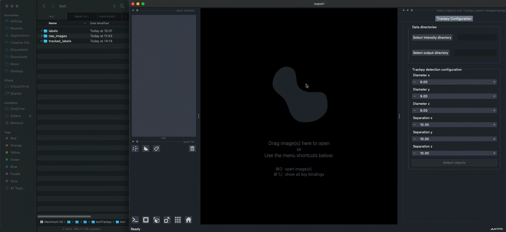
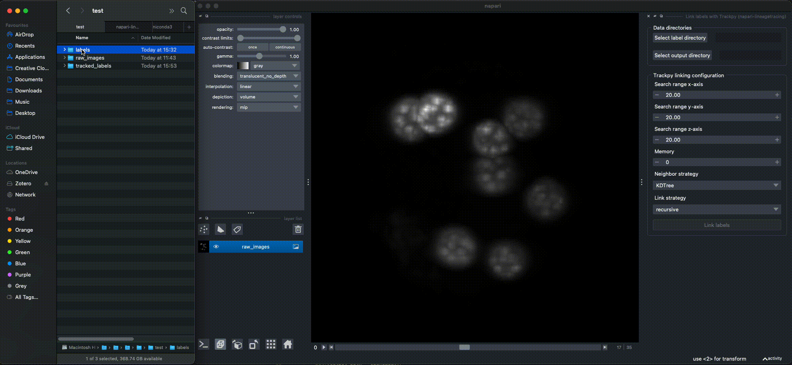
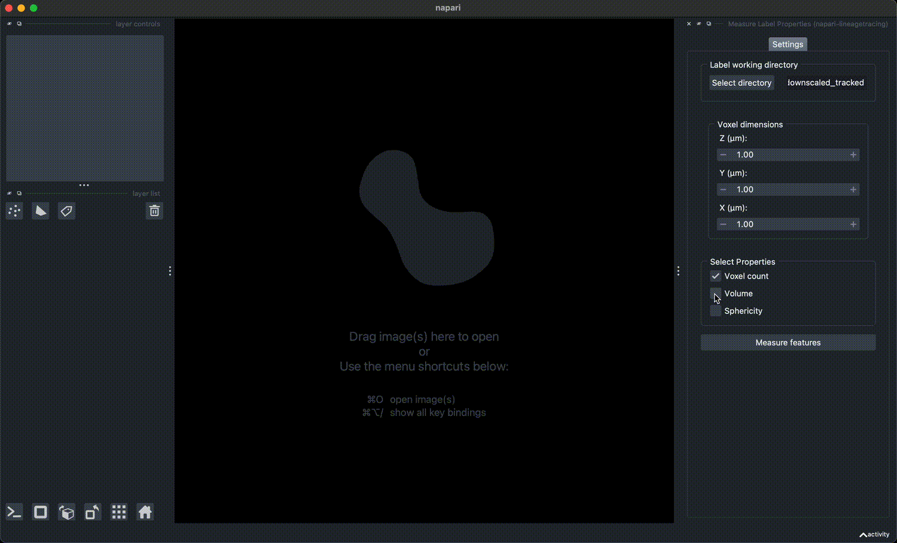

# napari-manual-tracking

A basis for a plugin for using trackpy within napari to detect and link objects in 3D time series, and manually correct the tracks and plot results. This plugin is not intended for automated tracking of large numbers of cells, rather its purpose is to help the user track small numbers (~50-100) of individual cells in samples that are relatively hard to track and require human input.

The plugin heavily relies on several very useful open source packages and other napari plugins:
- object detection and pretracking: [trackpy](http://soft-matter.github.io/trackpy/v0.6.1/)
- range sliders: [pyapp-kit superqt](https://github.com/pyapp-kit/superqt)
- orthogonal view widget: [napari multiple viewer widget](https://github.com/napari/napari/blob/e490e5535438ab338a23b17905a1952f15a6d27a/examples/multiple_viewer_widget.py)
- table widget: [napari-skimage-regionprops](https://github.com/haesleinhuepf/napari-skimage-regionprops)
- measuring label properties [skimage.measure.regionprops](https://scikit-image.org/instructions/stable/api/skimage.measure.html) and [porespy](https://github.com/PMEAL/porespy)

----------------------------------

This [napari] plugin was generated with [Cookiecutter] using [@napari]'s [cookiecutter-napari-plugin] template.

## Installation

You can install `napari-manual-tracking` via [pip]:

To install latest development version :

    pip install git+https://github.com/AnniekStok/napari-manual-tracking.git

## Usage

The plugin consists of 4 widgets intended to be used sequentially but can also be used independently.

### Detection of objects with trackpy
Objects can be detected using trackpy.locate in the 'Detect objects with Trackpy'-widget. You can select the estimated diameter in (x, y, z) and the minimal distance between objects (the trackpy default is the diameter in (x, y, z) + 1). After detection, you can further filter the objects using the range sliders for the mass (related to total brightness), signal (related to the contrast), and size (radius of gyration). When you confirm the chosen settings, a table with the selected objects is generated, as well as a series of 3D label images (one per time point), that can be used for tracking in the other widgets.  

Image data by Dimitri Fabrèges.

### Linking labels with trackpy
Labels in a time series of 3D label images, either created by the 'Detect objects with Trackpy'-widget or obtained with segmentation algorithms such as Cellpose can be linked together using the trackpy.link function. The results consists of relabeled label images (where tracked cells have the same label value across time) and a table (LabelAnnotations.csv) containing all time_points and label values. No parent-child hierarchy exists at this point. The 'parent' column in the table is set to -1 at this stage, which tells the 'Manual Division Tracker'-widget that this is a label that has not been verified by the user yet. 

Image data by Dimitri Fabrèges.

### Verifying tracking results and building parent-child connections
The trackpy results do not give information about the parent-child relationships between cells. Also, not all links may be correct, especially if the dataset is noisy. User input to manually verify the links and track parent-child relationships can be given using the 'Manual Division Tracker'-widget. Here, labels can be added in several ways:
- selecting the color of a label, followed by clicking with the fill bucket tool selected. 
- alternatively, in the case an object was not detected, it can be added by using the brush tool. 
- adding a row to the table and enter the label value there.
- overwriting an existing label with a new value. 

Tracked labels are shown in the plot widget at the bottom of the viewer. It is sorted by parent-child relationships of the different labels. A parent with label 0 indicates that this cell is a starting point (the parent is unknown, or it is the very first cell). Labels with a parent of -1 are ignored in the plot, as this value is used to indicate a non-verified cell. Only labels for which an existing parent is entered in the table are plotted. 

Results are saved to the same label directory, and consist of an updated 'LabelAnnotations.csv' table, updated label images, and the tree plot. 

Image data by Takafumi Ichikawa.

### Plotting tracking results
In the case the label represent cell or nucleus segmentations, the geometrical properties of the tracked labels can be measured using the 'Measure Label Properties' widget. Only labels with a parent that has a non -1 value are shown. After selecting the properties of interest, a plot and a table widget (from napari-skimage-regionprops, with some small adjustments) are shown, colored by label and sortable by column. Clicking on a row will results in only showing the label beloning to that row in both the viewer and plot below it. 

## Contributing

Contributions are very welcome. Tests can be run with [tox], please ensure
the coverage at least stays the same before you submit a pull request.

## License

Distributed under the terms of the [BSD-3] license,
"napari-manual-tracking" is free and open source software

## Issues

If you encounter any problems, please [file an issue] along with a detailed description.

[napari]: https://github.com/napari/napari
[Cookiecutter]: https://github.com/audreyr/cookiecutter
[@napari]: https://github.com/napari
[MIT]: http://opensource.org/licenses/MIT
[BSD-3]: http://opensource.org/licenses/BSD-3-Clause
[GNU GPL v3.0]: http://www.gnu.org/licenses/gpl-3.0.txt
[GNU LGPL v3.0]: http://www.gnu.org/licenses/lgpl-3.0.txt
[Apache Software License 2.0]: http://www.apache.org/licenses/LICENSE-2.0
[Mozilla Public License 2.0]: https://www.mozilla.org/media/MPL/2.0/index.txt
[cookiecutter-napari-plugin]: https://github.com/napari/cookiecutter-napari-plugin

[file an issue]: https://github.com/AnniekStok/napari-manual-tracking/issues

[napari]: https://github.com/napari/napari
[tox]: https://tox.readtheinstructions.io/en/latest/
[pip]: https://pypi.org/project/pip/
[PyPI]: https://pypi.org/
